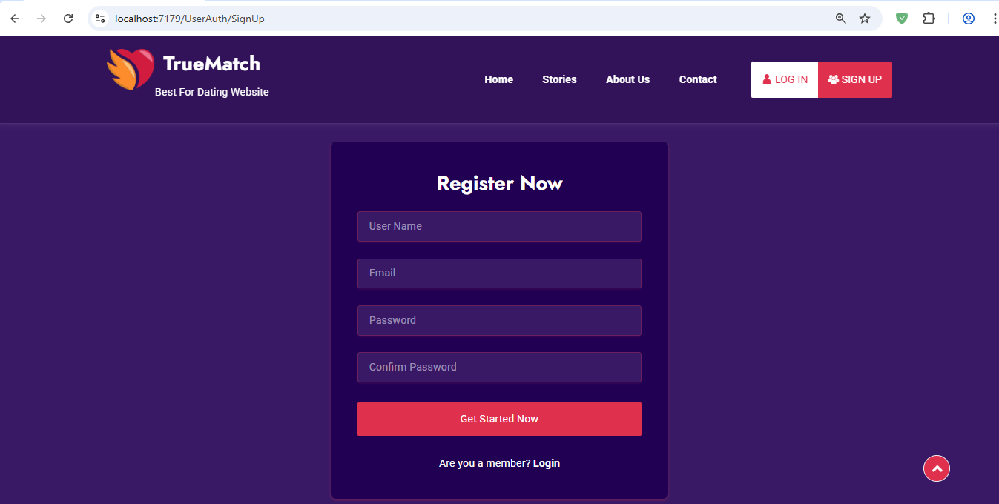

# 💖 TrueMatch - A Modern Dating Website Platform

TrueMatch is a fully responsive, user-friendly dating website developed using **ASP.NET Core MVC**. It enables users to connect, manage profiles, send friend requests, and chat with matches in a secure and interactive environment.

 <!-- Replace with an actual image path or GitHub-hosted image -->

---

## 🌐 Live Demo

🚀 _Coming soon_ or host it via [Azure](https://portal.azure.com) / [Render](https://render.com) / [Netlify](https://www.netlify.com/) (for static frontend only)

---

## 📌 Features

- 🔐 **User Authentication** (Sign Up, Log In, Log Out)
- 👤 **User Profiles** with editable settings
- ❤️ **Friend Requests & Friend List**
- 💬 **Private Messaging (Chat System)**
- 📚 **Success Stories & Blog**
- 📞 **Contact Us** and newsletter support
- 🎨 Responsive and animated **UI/UX** with Bootstrap & jQuery
- 🌐 Session management using `HttpContext.Session`

---

## 🛠️ Technologies Used

| Layer | Tools |
|-------|-------|
| **Frontend** | HTML5, CSS3, Bootstrap 5.3, jQuery,js |
| **Backend** | ASP.NET Core MVC |
| **Authentication** | ASP.NET Identity, Session |
| **Database** | SQL Server / SQLite (choose during setup) |
| **IDE** | Visual Studio 2022 |
---

## 📁 Project Structure

```plaintext
TrueMatch/
│
├── Controllers/
│   ├── HomeController.cs
│   ├── UserAuthController.cs
│   ├── UserProfileController.cs
│   ├── ChatController.cs
│   └── ...
│
├── Models/
│   ├── User.cs
│   ├── Message.cs
│   └── ...
│
├── Views/
│   ├── Shared/
│   │   └── _Layout.cshtml
│   ├── Home/
│   ├── UserAuth/
│   ├── UserProfile/
│   └── ...
│
├── wwwroot/
│   ├── assets/
│   │   ├── css/
│   │   ├── js/
│   │   └── images/
│
├── appsettings.json
└── TrueMatch.csproj

## Screenshots

### User Interface

#### Login/Signup



#### Profile Page


#### User Post


#### Search User


#### Friend


#### Message


### Admin Interface

#### Login


#### Admin Panel


